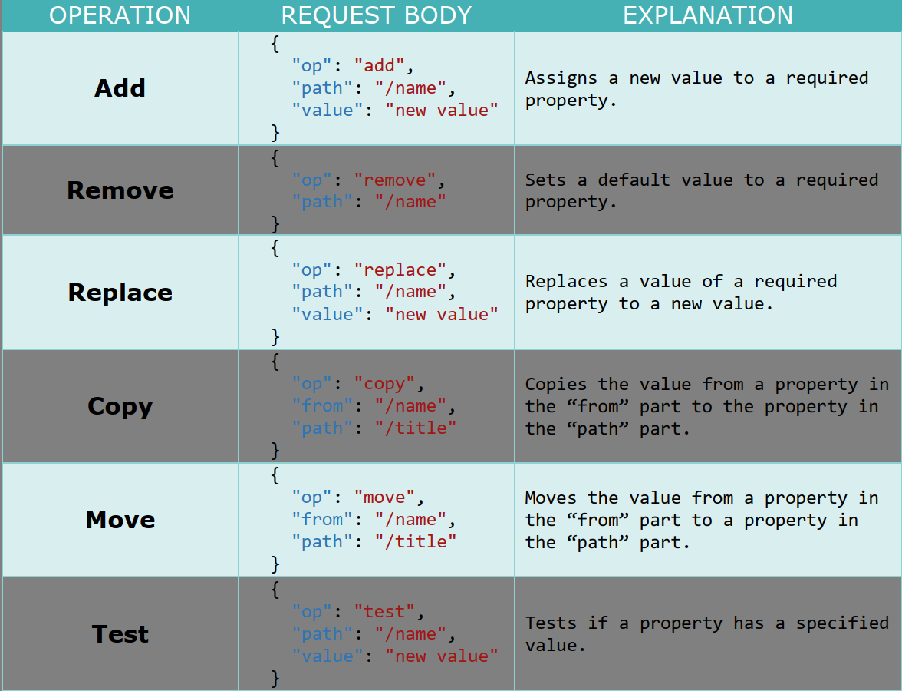
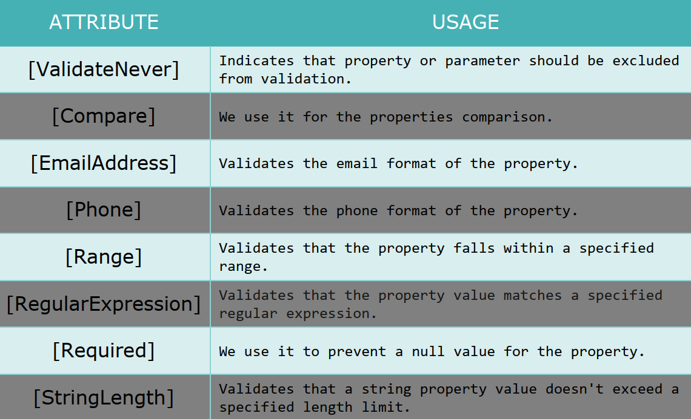
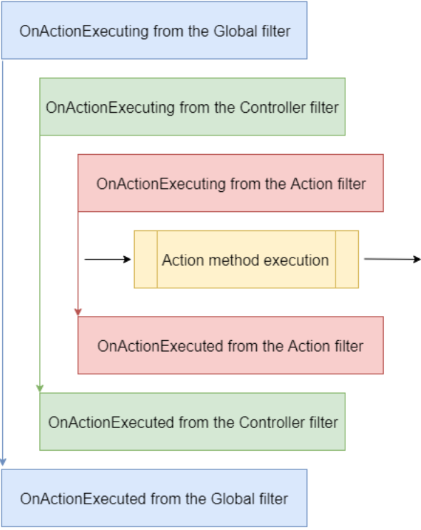
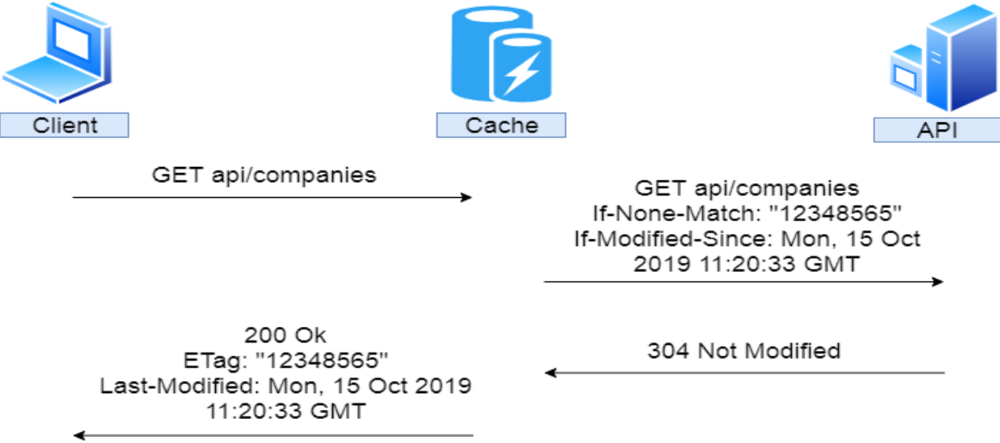

In this repo, I followed CodeMaze's [ASP.NET Core Series:](https://code-maze.com/net-core-series/) to learn .NET.

## Chapter 1: 

## Chapter 2: 

## Chapter 3: 

## Chapter 4: 

## Chapter 5: Global Error Handling

- Add ConfigureExceptionHandler, reigister with Program
- With the handler, we can remove try-catch block in all classes

## Chapter 6: Getting Additional Resources

- Getting single record: Company
- Defining a customer exception: CompanyNotFoundException, register it in ExceptionMiddlewareExtensions
- If the return is null, throw CompanyNotFoundException
- Repeat for Employee repository, service, controller

## Chapter 7: Content Negotiation

- The default return format is json
- Add RespectBrowserAcceptHeader to allow content negotiation, return xml
- Add  ReturnHttpNotAcceptable to return 406 when reqeust media type is not available
- Implementing customer formatter: CsvOutputFormatter, register to service extension, Program

## Chapter 8: Method Safety and Method Idempotency

- Safety: the resources shouldn't be changed after the method is executed
- Idempotency: calling a method multiple times with the same result

## Chapter 9: Creating Resources

- Using POST method to create resources, CreatedAtRoute method
- [ApiController] attribute's behaviors
- To enable custom response, add 
  
  ` builder.Services.Configure<ApiBehaviorOptions>(options =>
    {
        options.SuppressModelStateInvalidFilter = true;
    });
`
- Creating children resources together with a parent
- Creating a collection of resources
- Model Binding
 
## Chapter 10: Working with DELETE Request

- Deleting a record
- Deleting a parent resource with its children

## Chapter 11: Working with PUT Request

- Updating a record
- Inserting children resources with parent

## Chapter 12: Working with PATCH Reqeust

- PATCH updates a record partially, PUT updates the whole record
- PATCH: [FromBody]JsonPatchDocument<Company>, PUT: [FromBody]Company
- PATCH request's media type: application/json-patch+json, PATCH request's media type: application/json
- PATCH request body: 
  ``` json
  [
    {
    "op": "replace",
    "path": "/name",
    "value": "new name"
    },
    {
    "op": "remove",
    "path": "/name"
    }
  ]
  ```
- There are six different operations for a PATCH request:
  
- Configuring support for json patch using Newtonsoft.Json while leaving the other formatters unchanged
- With ReverseMap(), we can use map in reverse way. `CreateMap<EmployeeForUpdateDto, Employee>().ReverseMap()`

## Chapter 13: Validation

- Model State, Rerun validation, `ModelState.ClearValidationState(), TryValidateModel(), UnprocessableEntity()`
- The most used built-in attributes: 
  
  [Complete list](https://learn.microsoft.com/en-us/dotnet/api/system.componentmodel.dataannotations?view=net-5.0)
- Creating custom attribute with `ValidationAttribute, IValidatableObject`
- Adding annotation in Dto to apply built-in validation, `Required, MaxLength, Range`

## Chapter 14: Asynchronous Code

- `async` keywoard is to enable the `await` within the method
- `await` performs an asynchronous wait on its argument. If a method needs time to finish, the `await` keyword will pause the method execution and return an incomplete task. The `await` keyword does three things:
  - It helps us extract the result from the async operation – we already
learned about that
  - Validates the success of the operation
  - Provides the Continuation for executing the rest of the code in the
async method
- `Task` represents an execution of the asynchronous method and not the result. The `Task` has several properties that indicate whether the operation was completed successfully or not (`Status, IsCompleted, IsCanceled, IsFaulted`). With these
properties, we can track the flow of our async operations. This is also called TAP (Task-based Asynchronous Pattern).
- In asynchronous programming, we have three return tyeps:
  - `Task<TResult>`, for an async method that returns a value
  - `Task`, for an async method that does not return a value
  - `void`, which we can use for an event handler. We should
use void only for the asynchronous event handlers which require
a void return type. Other than that, we should always return a Task
- Refactoring repository, service, controller to asychronous

## Chapter 15: Action Filters

- There are different filter types
  - **Authorization filters** – They run first to determine whether a user
is authorized for the current request
  - **Resource filters** – They run right after the authorization filters and
are very useful for caching and performance
  - **Action filters** – They run right before and after action method
execution
  - **Exception filters** – They are used to handle exceptions before the
response body is populated
  - **Result filters** – They run before and after the execution of the
action methods result
- Synchronous Action filter that runs before and after
action method execution:
  ``` c#
  namespace ActionFilters.Filters
  {
    public class ActionFilterExample : IActionFilter
    {
      public void OnActionExecuting(ActionExecutingContext context)
      {
      // our code before action executes
      }
      public void OnActionExecuted(ActionExecutedContext context)
      {
      // our code after action executes
      }
    }
  }
  ```
- Asynchronous filter, we only have one method to implement the OnActionExecutionAsync.
  ``` c#
  namespace ActionFilters.Filters
  {
    public class AsyncActionFilterExample : IAsyncActionFilter
    {
      public async Task OnActionExecutionAsync(ActionExecutingContext context,
      ActionExecutionDelegate next)
      {
      // execute any code before the action executes
      var result = await next();
      // execute any code after the action executes
      }
    }
  }
  ```
- The action filter can be added to different scope levels: Global, Action, and Controller
  - If we want to use our filter globally, we need to register it inside the AddControllers() method in the Program class
    ``` c#
    builder.Services.AddControllers(config =>
    {
    config.Filters.Add(new GlobalFilterExample());
    });
    ```
  - On the Action or Controller level, we need to register it, but as a service in the IoC container:
    ``` c#
    builder.Services.AddScoped<ActionFilterExample>();
    builder.Services.AddScoped<ControllerFilterExample>();
    ```
  - To use a filter registered on the Action or Controller level, we need to place it on top of the Controller or Action as a ServiceType:
    ``` c#
    namespace AspNetCore.Controllers
    {
      [ServiceFilter(typeof(ControllerFilterExample))]
      [Route("api/[controller]")]
      [ApiController]
      public class TestController : ControllerBase
      {
        [HttpGet]
        [ServiceFilter(typeof(ActionFilterExample))]
        public IEnumerable<string> Get()
        {
          return new string[] { "example", "data" };
        }
      }
    }
    ```
- The order in which our filters are executed is as follows:
  
  - we can change the order of invocation by adding the Order property to the invocation statement:
    ``` c#
    namespace AspNetCore.Controllers
    {
      [ServiceFilter(typeof(ControllerFilterExample), Order = 2)]
      [Route("api/[controller]")]
      [ApiController]
      public class TestController : ControllerBase
      {
        [HttpGet]
        [ServiceFilter(typeof(ActionFilterExample), Order = 1)]
        public IEnumerable<string> Get()
        {
          return new string[] { "example", "data" };
        }
      }
    }
    ```
    ``` c#
    [HttpGet]
    [ServiceFilter(typeof(ActionFilterExample), Order = 2)]
    [ServiceFilter(typeof(ActionFilterExample2), Order = 1)]
    public IEnumerable<string> Get()
    {
      return new string[] { "example", "data" };
    }
    ```

## Chapter 16: Paging

- Pageing means getting partial results from an API
  ``` c#
  public abstract class RequestParameters
      {
          const int maxPageSize = 50;
          public int PageNumber { get; set; } = 1;

          private int _pageSize = 10;
          public int PageSize 
          { 
              get 
              { 
                  return _pageSize;
              }
              set
              {
                  _pageSize = (value > maxPageSize) ? maxPageSize : value;
              }
          }
      }
  ```
- PagedList will inherit from the List class, we can also move the skip/take logic to the PagedList:
  ``` c#
  public class MetaData
  {
		public int CurrentPage { get; set; }
		public int TotalPages { get; set; }
		public int PageSize { get; set; }
		public int TotalCount { get; set; }

		public bool HasPrevious => CurrentPage > 1;
		public bool HasNext => CurrentPage < TotalPages;
	}
  ```
  ``` c#
  public class PagedList<T> : List<T>
  {
    public MetaData MetaData { get; set; }
    public PagedList(List<T> items, int count, int pageNumber, int pageSize)
    {
        MetaData = new MetaData
        {
            TotalCount = count,
            PageSize = pageSize,
            CurrentPage = pageNumber,
            TotalPages = (int)Math.Ceiling(count / (double)pageSize),
        };

        AddRange(items);
    }

    public static PagedList<T> ToPagedList(IEnumerable<T> source, int pageNumber, int pageSize)
    {
        var count = source.Count();
        var items = source.Skip((pageNumber - 1) * pageSize).Take(pageSize).ToList();

        return new PagedList<T>(items, count, pageNumber, pageSize);
    }
  }
  ```
- Implementing in repository, service, controller

## Chapter 17: Filtering

``` c#
public class EmployeeParameters : RequestParameters
    {
        public uint MinAge { get; set; }
        public uint MaxAge { get; set; } = int.MaxValue;
        public bool ValidAgeRange => MaxAge > MinAge;
    }
```
``` c#
var employees = await FindByCondition(e => e.CompanyId.Equals(companyId)
          && (e.Age >= employeeParameters.MinAge && 
          e.Age <= employeeParameters.MaxAge), trackChanges)
          .OrderBy(e => e.Name)
          .ToListAsync();
```

## Chapter 18: Searching

``` c#
var employees = await FindByCondition(e => e.CompanyId.Equals(companyId), trackChanges)
                .FilterEmployees(employeeParameters.MinAge, employeeParameters.MaxAge)
                .Search(employeeParameters.SearchTerm)
                .OrderBy(e => e.Name)
                .ToListAsync();
```
``` c#
public static class RepositoryEmployeeExtensions
  {
      public static IQueryable<Employee> FilterEmployees(this IQueryable<Employee> employees,
          uint minAge, uint maxAge) =>
          employees.Where(e => e.Age >= minAge && e.Age <= maxAge);

      public static IQueryable<Employee> Search(this IQueryable<Employee> employees, string searchTerm)
      {
          if (string.IsNullOrWhiteSpace(searchTerm))
              return employees;

          var lowerCaseTerm = searchTerm.Trim().ToLower();

          return employees.Where(e => e.Name.ToLower().Contains(lowerCaseTerm));
      }
  }
```

## Chapter 19: Sorting

``` c#
public class EmployeeParameters : RequestParameters
{
    public EmployeeParameters() => OrderBy = "name";

    public uint MinAge { get; set; }
    public uint MaxAge { get; set; } = int.MaxValue;
    public bool ValidAgeRange => MaxAge > MinAge;

    public string? SearchTerm { get; set; }
}
```
``` c#
public static IQueryable<Employee> Sort(this IQueryable<Employee> employees, string orderByQueryString)
{
    if (string.IsNullOrWhiteSpace(orderByQueryString))
        return employees.OrderBy(e => e.Name);

    var orderParams = orderByQueryString.Trim().Split(',');
    var propertyInfos = typeof(Employee).GetProperties(BindingFlags.Public | BindingFlags.Instance);
    var orderQueryBuilder = new StringBuilder();

    foreach (var param in orderParams)
    {
        if (string.IsNullOrWhiteSpace(param))
            continue;

        var propertyFromQueryName = param.Split(" ")[0];
        var objectProperty = propertyInfos.FirstOrDefault(pi =>
        pi.Name.Equals(propertyFromQueryName, StringComparison.CurrentCultureIgnoreCase));

        if (objectProperty == null)
            continue;

        var direction = param.EndsWith(" desc") ? "descending" : "ascending";
        orderQueryBuilder.Append($"{objectProperty.Name.ToString()} {direction},");
    }

    var orderQuery = orderQueryBuilder.ToString().TrimEnd(',', ' ');

    if (string.IsNullOrWhiteSpace(orderQuery))
        return employees.OrderBy(e => e.Name);

    return employees.OrderBy(orderQuery);
}
```

## *Chapter 20: Data Shaping

- Data shaping is a great way to reduce the amount of traffic sent from the API to the client. It enables the consumer of the API to select (shape) the data by choosing the fields through the query string. For example: https://localhost:5001/api/companies/companyId/employees?fields=name,age
- DataShaper, ExpandoObject, XML
  ``` c#
  using Contracts;
  using System.Dynamic;
  using System.Reflection;

  namespace Service.DataShaping
  {
      public class DataShaper<T> : IDataShaper<T> where T : class
      {
          public PropertyInfo[] Properties { get; set; }
          
          public DataShaper()
          {
              Properties = typeof(T).GetProperties(BindingFlags.Public | BindingFlags.Instance);
          }

          public IEnumerable<ExpandoObject> ShapeData(IEnumerable<T> entities, string fieldsString)
          {
              var requiredProperties = GetRequiredProperties(fieldsString);
              
              return FetchData(entities, requiredProperties);
          }

          public ExpandoObject ShapeData(T entity, string fieldsString)
          {
              var requiredProperties = GetRequiredProperties(fieldsString);

              return FetchDataForEntity(entity, requiredProperties);
          }

          private IEnumerable<PropertyInfo> GetRequiredProperties(string fieldsString)
          {
              var requiredProperties = new List<PropertyInfo>();

              if (!string.IsNullOrWhiteSpace(fieldsString))
              {
                  var fields = fieldsString.Split(',', StringSplitOptions.RemoveEmptyEntries);

                  foreach ( var field in fields)
                  {
                      var property = Properties.FirstOrDefault(pi =>
                      pi.Name.Equals(field.Trim(), StringComparison.InvariantCultureIgnoreCase));

                      if (property == null)
                          continue;

                      requiredProperties.Add(property);
                  }
              }
              else
              {
                  requiredProperties = Properties.ToList();
              }

              return requiredProperties;
          }

          private IEnumerable<ExpandoObject> FetchData(IEnumerable<T> entities, 
              IEnumerable<PropertyInfo> requiredProperties)
          {
              var shapedData = new List<ExpandoObject>();

              foreach (var entity in entities)
              {
                  var shapedObject = FetchDataForEntity(entity, requiredProperties);
                  shapedData.Add(shapedObject);
              }

              return shapedData;
          }

          private ExpandoObject FetchDataForEntity(T entity, IEnumerable<PropertyInfo> requiredProperties)
          {
              var shapedObject = new ExpandoObject();

              foreach (var property in requiredProperties)
              {
                  var objectPropertyValue = property.GetValue(entity);
                  shapedObject.TryAdd(property.Name, objectPropertyValue);
              }

              return shapedObject;
          }
      }
  }
  ```

## *Chapter 21: Supporting HATEOAS

- Whta is HATEOAS
- Links
- We can create a custom media type. A custom media type should look something like this:
`application/vnd.codemaze.hateoas+json`.
  - vnd – vendor prefix; it’s always there
  - codemaze – vendor identifier
  - hateoas – media type name
  - json – suffix; we can use it to describe if we want json or an XML response

## Chapter 22: Working with OPTIONS and HEAD Requests

- The Options request can be used to request information on the communication options available upon a certain URI. Basically, Options should inform us whether we can Get a resource or execute any other action (POST, PUT, or DELETE). All of the options should be returned in the Allow header of the response as a commaseparated list of methods.
``` c#
[HttpOptions]
public IActionResult GetCompaniesOptions()
{
    Response.Headers.Add("Allow", "GET, OPTIONS, POST");

    return Ok();
}
```
- The Head is identical to Get but without a response body. This type of request could be used to obtain information about validity, accessibility, and recent modifications of the resource. All we have to do is add the HttpHead attribute below HttpGet.
``` c#
using Entities.LinkModels;
using Microsoft.AspNetCore.Mvc;
using Microsoft.AspNetCore.Routing;

namespace CompanyEmployees.Presentation.Controllers
{
    [Route("api")]
    [ApiController]
    public class RootController : ControllerBase
    {
        private readonly LinkGenerator _linkGenerator;

        public RootController(LinkGenerator linkGenerator) =>_linkGenerator = linkGenerator;

        [HttpGet(Name = "GetRoot")]
        public IActionResult GetRoot([FromHeader(Name = "Accept")] string mediaType)
        {
            if (mediaType.Contains("application/vnd.codemaze.apiroot"))
            {
				var list = new List<Link>
				{
					new Link
					{
						Href = _linkGenerator.GetUriByName(HttpContext, nameof(GetRoot), new {}),
						Rel = "self",
						Method = "GET"
					},
					new Link
					{
						Href = _linkGenerator.GetUriByName(HttpContext, "GetCompanies", new {}),
						Rel = "companies",
						Method = "GET"
					},
					new Link
					{
						Href = _linkGenerator.GetUriByName(HttpContext, "CreateCompany", new {}),
						Rel = "create_company",
						Method = "POST"
					}
				};

				return Ok(list);
			}

			return NoContent();
        }

    }
}
```

## Chapter 24: Versioning APIs

- ConfigureVersioning() with packege `Microsoft.AspNetCore.Mvc.Versioning`:
  ``` c#
  public static void ConfigureVersioning(this IServiceCollection services)
  {
      services.AddApiVersioning(opt =>
      {
          opt.ReportApiVersions = true;
          opt.AssumeDefaultVersionWhenUnspecified = true;
          opt.DefaultApiVersion = new ApiVersion(1, 0);
      });
  }
  ```
- `[ApiVersion("2.0")]`, request in uri: https://localhost:5001/api/companies?api-version=2.0
- Using URL versioning: 
  ``` c#
  [ApiVersion("2.0")]
  [Route("api/{v:apiversion}/companies")]
  ```
  https://localhost:5001/api/2.0/companies
- If we don’t want to change the URI of the API, we can send the version in the HTTP Header. `opt.ApiVersionReader = new HeaderApiVersionReader("api-version");`
- If we want to deprecate version of an API, but don’t want to remove it completely, we can use the Deprecated property for that purpose: `[ApiVersion("2.0", Deprecated = true)]`
- If we have a lot of versions of a single controller, we can assign these versions in the configuration instead. We can remove the `[ApiVersion]` attribute from the controllers.
  ``` c#
  opt.Conventions.Controller<CompaniesController>()
  .HasApiVersion(new ApiVersion(1, 0));
  opt.Conventions.Controller<CompaniesV2Controller>()
  .HasDeprecatedApiVersion(new ApiVersion(2, 0));
  ```

## Chapter 25: Caching

- There are three types of caches: 
  - Client Cache: lives on the client (browser); thus, it is a private cache. It is private because it is related to a single client.
  - Gateway Cache:  lives on the server and is a shared cache.
  - Proxy Cache: is also a shared cache, but it doesn’t live on the server nor the client side. It lives on the network.
- To cache some resources, we have to know whether or not it’s cacheable. The response header helps us with that. The one that is used most often is `Cache-Control: Cache-Control: max-age=180`.
- `[ResponseCache(Duration = 60)]`
- ConfigureResponseCaching()
  ``` c#
  public static void ConfigureResponseCaching(this IServiceCollection services) =>
              services.AddResponseCaching();
  ```
  ``` c#
  builder.Services.ConfigureResponseCaching();
  ```
  ``` c#
  app.UseCors("CorsPolicy");
  app.UseResponseCaching();
  ```
- `CacheProfiles`:
  ``` c#
  builder.Services.AddControllers(config => {
    ...
    config.CacheProfiles.Add("120SecondsDuration", new CacheProfile { Duration = 120});
  })...
  ```
  Adding `[ResponseCache(CacheProfileName = "120SecondsDuration")]` on top of the Companies controller. This cache rule will apply to all the actions inside the controller except the ones that already have the ResponseCache attribute applied.
- Validation Model: the value is caches, the second reqeust get value from cache store, but we don't know if the cased value is the latest value (someone could modified the value), so the cache server communicate with API server, if not modified, API server returns 304 Not Modified status, then the cached the value is served.
  
- Supporting Validation with package `Marvin.Cache.Headers`:
  ``` c#
  public static void ConfigureHttpCacheHeaders(this IServiceCollection services) => 
  services.AddHttpCacheHeaders();
  ```
  ```c#
  builder.Services.ConfigureHttpCacheHeaders();
  ```
  ```c#
  app.UseHttpCacheHeaders();
  ```
- Configuring our expiration and validation headers globally.
  ```c#
  public static void ConfigureHttpCacheHeaders(this IServiceCollection services) =>
      services.AddHttpCacheHeaders(
          (expirationOpt) =>
          {
              expirationOpt.MaxAge = 65;
              expirationOpt.CacheLocation = CacheLocation.Private;
          },
          (validationOpt) =>
          {
              validationOpt.MustRevalidate = true;
          }
          );
  ```
- Other than global configuration, we can apply it on the resource level (on action or controller). The overriding rules are the same. Configuration on the action level will override the configuration on the controller or global level. Also, the configuration on the controller level will override the global
level configuration.
- Configuring resource level configuration:
  ```c#
  [HttpCacheExpiration(CacheLocation = CacheLocation.Public, MaxAge = 60)]
  [HttpCacheValidation(MustRevalidate = false)]
  ```
-  The `ResponseCaching` library doesn’t correctly implement the validation model, alternatives:
   -  Varnish - https://varnish-cache.org/
   -  Apache Traffic Server - https://trafficserver.apache.org/
   -  Squid - http://www.squid-cache.org/